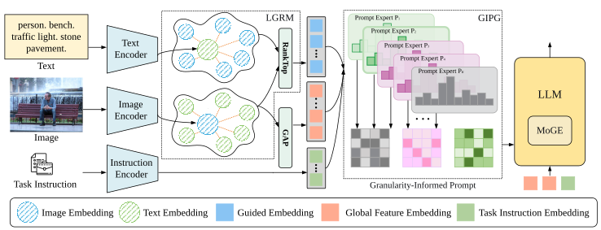

# GIP-MoE: Granularity-Informed Prompt Mixture of Experts for Open-Vocabulary Object Detection

## Introduction
Open-vocabulary object detection (OVD) aims to recognize and localize object categories unseen during training by leveraging vision-language knowledge. Existing methods mainly align region features with class names or region-level phrases, which provides fine-grained object semantics but lacks global scene context, object actions, spatial relationships, and inter-object interactions. Recently, large language models (LLMs) have been introduced to generate image-level descriptions as complementary supervision. However, most LLM-based OVD methods employ shared fixed prompts across different images, making the generated descriptions insufficiently adaptive to image-specific object compositions, attributes, and interactions. Moreover, image-level and region-level descriptions focus on different semantic scopes, while sharing the same language adaptation pathway may introduce cross-granularity interference. To address these issues, we propose Granularity-Informed Prompt Mixture of Experts (GIP-MoE), which adaptively generates language supervision according to both visual content and description granularity. Specifically, we design Granularity-Informed Prompt Generation (GIPG) to integrate global visual features, region-level semantics, and task instructions for adaptive prompt expert selection. To provide more informative local cues for prompt routing, Language-Guided Region Mamba (LGRM) selects text-relevant regions and extracts fine-grained object semantics while suppressing background interference. Furthermore, Mixture of Granularity Experts (MoGE) assigns specialized language adaptation pathways to image-level and region-level generation tasks, thereby alleviating cross-granularity interference and producing more effective multi-granularity language supervision for OVD.

## Architecture Overview
             

## Results and Models


| Model | AP<sup>mini</sup> | AP<sub>r</sub> | AP<sub>c</sub> | AP<sub>f</sub> | AP<sup>val</sup> | AP<sub>r</sub> | AP<sub>c</sub> | AP<sub>f</sub> | Checkpoints |
|:------|:-----------------:|:---------------:|:---------------:|:---------------:|:---------------:|:---------------:|:---------------:|:---------------:|:-----------:|
| GIP-MoE Swin-T | 44.7 | 36.7 | 40.2 | 50.2 | 34.2 | 24.9 | 29.6 | 43.5 | [Google Drive](https://drive.google.com/file/d/1SfMtI2iPpNN5XrhbE6fwPs5p5YLvoJCW/view?usp=sharing) |
| GIP-MoE Swin-B | 48.6 | 40.9 | 44.5 | 53.7 | 38.0 | 28.1 | 33.7 | 47.2 | [Google Drive](https://drive.google.com/drive/folders/1lstqS4qfnwWTn6pypyNt07s-cql7ZMkk?usp=share_link) |
| GIP-MoE Swin-L | 51.1 | 44.5 | 46.7 | 56.2 | 41.5 | 31.1 | 38.3 | 49.7 | [Google Drive](https://drive.google.com/file/d/1T36Lo-PVBNbPtNLk1a4G92nae89cI8dL/view?usp=sharing) |

Pretrained checkpoints are available on [Google Drive](https://drive.google.com/drive/folders/1LpSnL2dKDP1epApCFNw7xg0VBGoXpbg1?hl=zh-cn).

<p align="center">
  
</p>
## Usage

### Installation
You can set up the Environment with conda and pip as follows:
```
conda create -n gip_moe python=3.10 -y
conda activate gip_moe
pip install torch==2.2.1 torchvision==0.17.1 
pip install transformers==4.37.2 mmcv==2.2.0 mmengine==0.10.5 mmdet==3.0.0
pip install deepspeed peft timm fairscale jsonlines pycocotools lvis nltk wandb
pip install mamba-ssm causal-conv1d einops opencv-python scikit-image
```
### Dataset

```
｜--huggingface
｜  |--bert-base-uncased
｜  |--mm_grounding_dino
｜  |--siglip-so400m-patch14-384
｜  |--llava-onevision-qwen2-0.5b-ov-2

｜--grounding_data 
｜  |--coco
｜  |  |--annotations 
｜  |  |  |--instances_train2017_vg_merged6.jsonl
｜  |  |  |--instances_val2017.json
｜  |  |  |--instances_val2017.65.json
｜  |  |  |--lvis_v1_minival_inserted_image_name.json
｜  |  |  |--lvis_od_val.json
｜  |  |--train2017
｜  |  |--val2017
｜  |--flickr30k_entities
｜  |  |--flickr_train_vg7.jsonl
｜  |  |--flickr30k_images
｜  |--gqa
｜  |  |--gqa_train_vg7.jsonl
｜  |  |--images
｜  |--llava_cap
｜  |  |--LLaVA-ReCap-558K_tag_box_vg7.jsonl
｜  |  |--images
｜  |--v3det
｜  |  |--annotations
｜  |  |  |--v3det_2023_v1_train_vg7.jsonl
｜  |  |--images
｜--GIP-MoE (code)
```

- pretrained models
  - `bert-base-uncased`: Available at [Hugging Face](https://huggingface.co/datasets/LDLlidailin/GIP-MoE/tree/main/huggingface/bert-base-uncased).
  
  - `mm_grounding_dino`: Available at [Hugging Face](https://huggingface.co/datasets/LDLlidailin/GIP-MoE/tree/main/huggingface/mm_grounding_dino).
  
  - `siglip-so400m-patch14-384`: Available at [Hugging Face](https://huggingface.co/datasets/LDLlidailin/GIP-MoE/tree/main/huggingface/siglip-so400m-patch14-384).

  - `llava-onevision-qwen2-0.5b-ov`: Available at [Hugging Face](https://huggingface.co/datasets/LDLlidailin/GIP-MoE/tree/main/huggingface/llava-onevision-qwen2-0.5b-ov).

- grounding data (GroundingCap-1M)
  - `coco`: Available at [Hugging Face](https://huggingface.co/datasets/LDLlidailin/GIP-MoE/tree/main/grounding_data/coco).
  - `lvis`: The LVIS annotations are provided [here](https://huggingface.co/datasets/LDLlidailin/GIP-MoE/tree/main/grounding_data/coco/annotations).
  - `flickr30k_entities`: Available at [Hugging Face](https://huggingface.co/datasets/LDLlidailin/GIP-MoE/tree/main/grounding_data/flickr30k_entities).
  - `gqa`: Available at [Hugging Face](https://huggingface.co/datasets/LDLlidailin/GIP-MoE/tree/main/grounding_data/gqa).
  - `llava_cap`: Available at [Hugging Face](https://huggingface.co/datasets/LDLlidailin/GIP-MoE/tree/main/grounding_data/llava_cap).
  - `v3det`: Available at [Hugging Face](https://huggingface.co/datasets/LDLlidailin/GIP-MoE/tree/main/grounding_data/v3det).
  - Our generated JSONL files are provided [here](https://huggingface.co/datasets/LDLlidailin/GIP-MoE/tree/main/grounding_data).
  - For other evaluation datasets, please refer to [MM-GDINO](https://github.com/open-mmlab/mmdetection/blob/main/configs/mm_grounding_dino/dataset_prepare.md).


### 5 Usage

#### 5.1 Training

```
bash dist_train.sh configs/gip_moe_swin_t.py 4 --amp
```

#### 5.2 Evaluation

```
bash dist_test.sh configs/gip_moe_swin_t.py gip_moe_swin_t.pth 4
```

